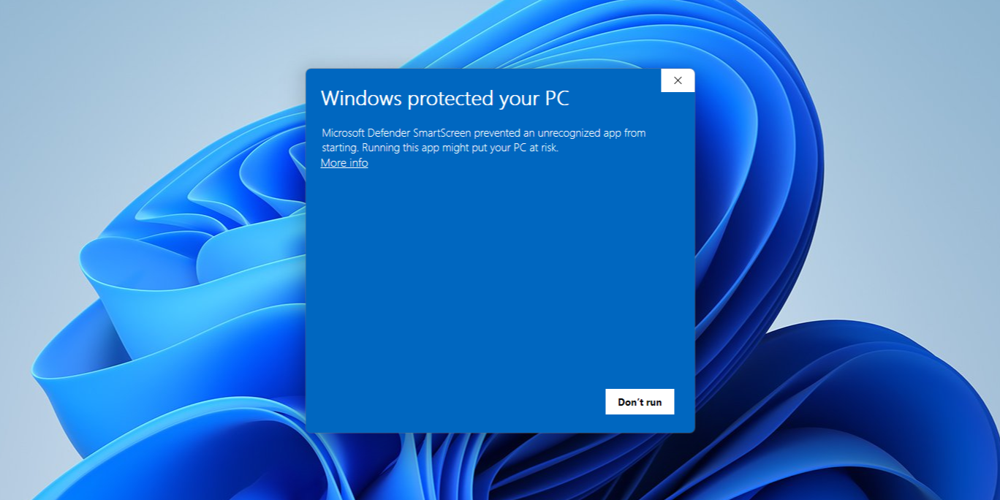
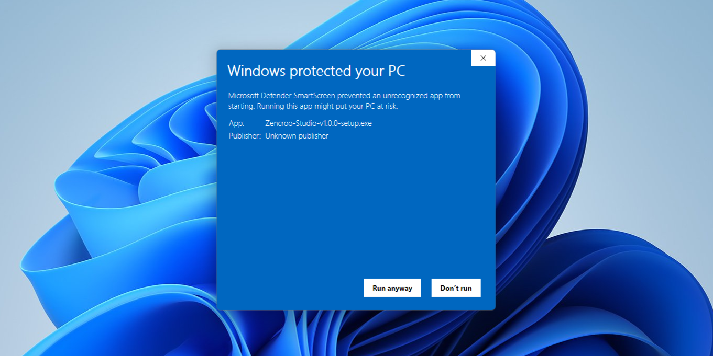
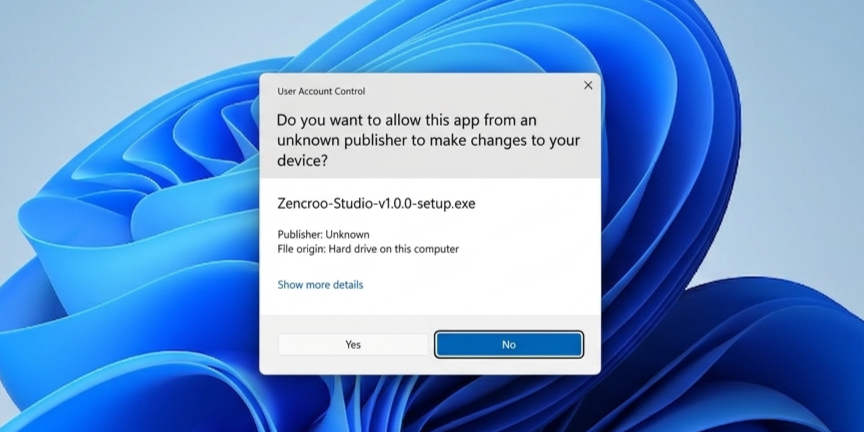
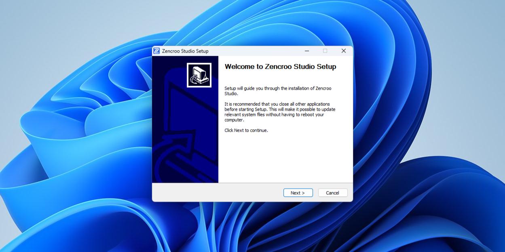
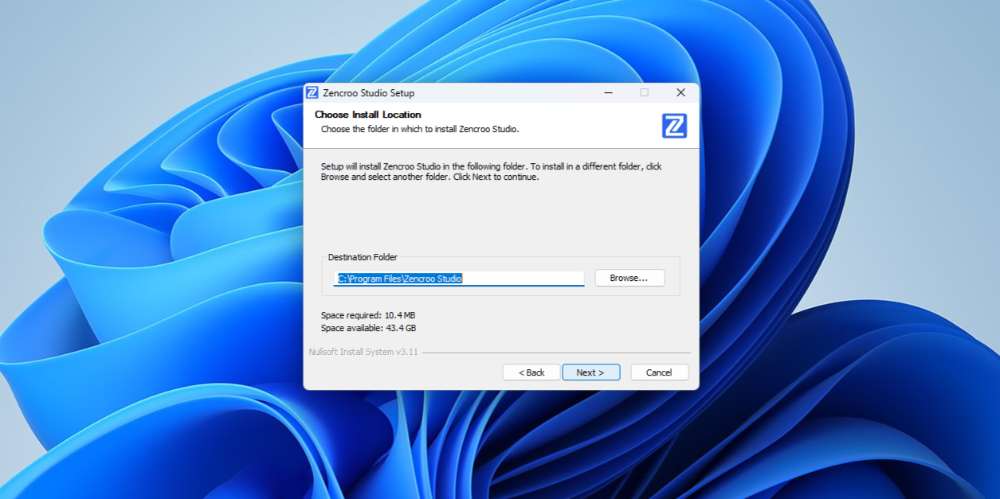
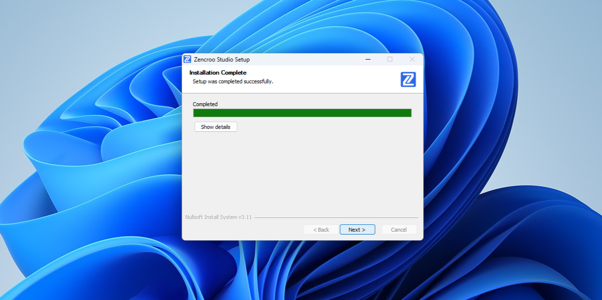
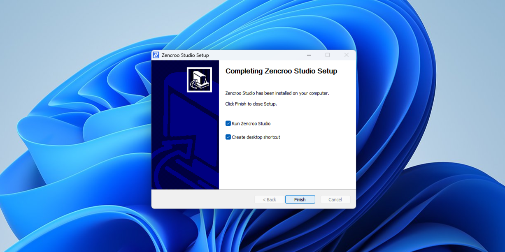
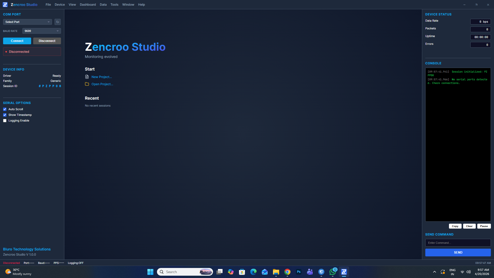

# 💿 Installation Guide — Zencroo Studio

  
  
  

This guide provides comprehensive, step-by-step instructions to get **Zencroo Studio** up and running on your system. Whether you are using the installer or the portable version, follow these steps for a smooth setup.

---

## 📋 Table of Contents
1. [System Requirements](#1-system-requirements)
2. [Obtaining the Software](#2-obtaining-the-software)
3. [Installation Process](#3-installation-process)
4. [Peripheral Drivers (COM Ports)](#4-peripheral-drivers-com-ports)
5. [First Launch & Setup](#5-first-launch--setup)
6. [Troubleshooting](#6-troubleshooting)

---

## 💻 1. System Requirements

Before installing, please ensure your system meets the following specifications to ensure optimal performance of the real-time visualization engine.

| Component | Minimum Specification | Recommended |
| :--- | :--- | :--- |
| **Operating System** | Windows 10 (64-bit) | Windows 11 (64-bit) |
| **Processor** | Dual-core 1.8GHz | Quad-core 2.4GHz+ |
| **Memory (RAM)** | 4GB | 8GB+ |
| **Storage** | 200 MB free space | SSD with 500 MB+ free |
| **Connectivity** | USB 2.0/3.0 Port | High-speed USB 3.1 Port |
| **Display** | 1280 x 720 | 1920 x 1080 (FHD) |

---

## 📥 2. Obtaining the Software

To ensure you have the latest features and security updates, always download Zencroo Studio from official sources.

1.  Navigate to the [**Official GitHub Releases**](https://github.com/blurotech/zencroostudio/releases) page.
2.  Choose the distribution format that fits your needs:
    *   📦 **Setup Installer** (`Zencroo_Studio_v1.0.0_setup.exe`): Recommended for most users. Provides automatic updates and Start Menu integration.
    *   🚀 **Portable Version** (`Zencroo_Studio_v1.0.0_portable.zip`): No installation required. Ideal for running from USB drives or restricted environments.

---

## 🚀 3. Installation Process

Follow these steps to deploy the software on your Windows machine. We have included security "Trust" steps to ensure a smooth bypass of Windows Defender for this specialized hardware tool.

### Step 1: Security Bypass (SmartScreen)
When you launch the installer, Windows may display a "Windows protected your PC" prompt.
*   Click on **"More info"**.
*   Then click **"Run anyway"**.

   &nbsp; 

### Step 2: Administrative Trust (UAC)
A User Account Control prompt will appear asking for permission to make changes.
*   Click **"Yes"** to trust the publisher and proceed.

  

### Step 3: Setup Wizard
The Zencroo Studio Setup Wizard will initialize.
*   Click **"Next >"** on the Welcome screen.
*   Choose your preferred **Install Location** (default is recommended).
*   Click **"Next >"** to begin extraction.

   &nbsp; 

### Step 4: Finalizing Installation
Once the progress bar is complete:
*   Click **"Next >"**.
*   Ensure **"Run Zencroo Studio"** is checked and click **"Finish"**.

   &nbsp; 

---

## 🔌 4. Peripheral Drivers (COM Ports)

Zencroo Studio interfaces with hardware via Serial (COM) ports. For the software to communicate with your microcontrollers, your system must recognize the USB-to-Serial bridge on your device.

### Common Driver Requirements:
If your device does not appear in the COM Port list within the app, you may need one of these drivers:

*   **CH340/CH341**: Used by many Arduino clones and ESP8266/ESP32 boards.
*   **CP210x**: Common on official ESP32 DevKits and specialized sensors.
*   **FTDI VCP**: Used in professional industrial serial converters.

> [!TIP]
> If a device is plugged in but not visible, check the **Windows Device Manager** under "Ports (COM & LPT)" to see if it's listed correctly or shows a yellow warning icon.

---

## 🏁 5. First Launch & Setup

Once the application launches, you will see the main dashboard.

  

1.  **Plug in** your hardware device via USB.
2.  In the **Left Sidebar**:
    *   Click **Refresh** (↻) to detect the new COM Port.
    *   Select your device's port (e.g., `COM3`).
    *   Set the **Baud Rate** (match your firmware code, e.g., `115200`).
3.  Click **Connect** or press `Ctrl + K`.
4.  Switch to the **Console View** (`Ctrl + 1`) to verify incoming data.

---

## 🛠️ 6. Troubleshooting

| Issue | Potential Solution |
| :--- | :--- |
| **App won't start** | Try running as Administrator or check if an Anti-virus is blocking the process. |
| **COM Port not found** | Ensure the USB cable supports data (not just charging) and drivers are installed. |
| **Permission Denied** | Ensure no other software (like Arduino IDE Serial Monitor) is using the same COM Port. |
| **Graphics Lag** | Ensure your GPU drivers are up to date and close high-resource background apps. |

---

**Need Further Assistance?**  
📖 Refer to the [README.md](./README.md) for detailed usage instructions.  
📧 Contact Support: [blurotech.in@gmail.com](mailto:blurotech.in@gmail.com)

---

  <i>Developed with ❤️ by Bluro Technology Solutions</i>

